# LatihanVCS

- Faqih Irianto (312210021)

##Tutorial Menambahkan gambar

- Kita membuat Repository di web Github
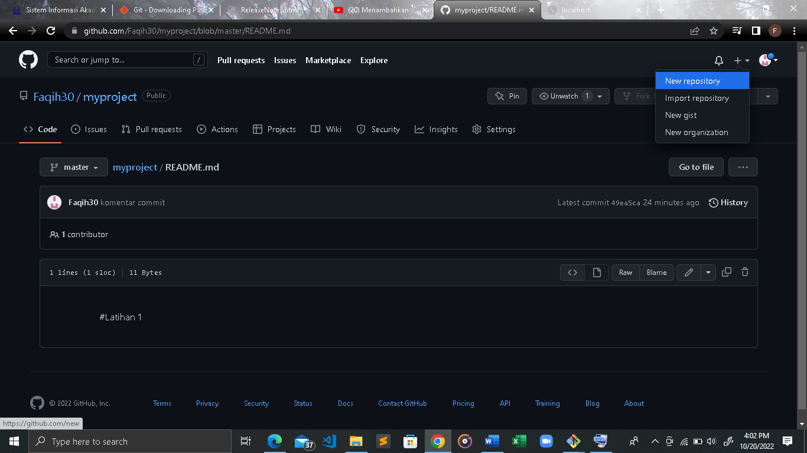

- Masukkan folder foto kedalam repository
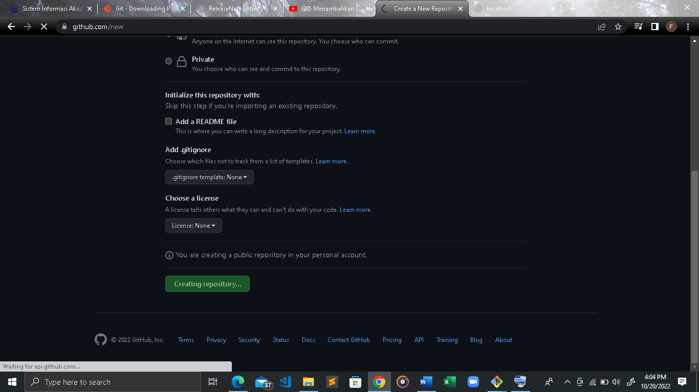

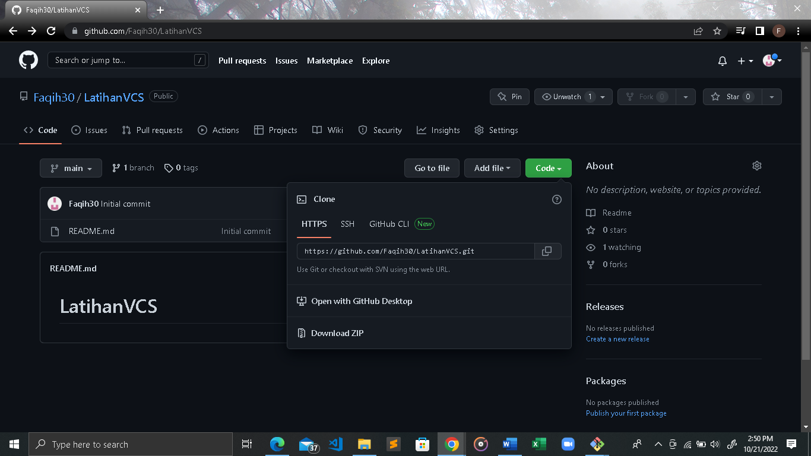

- Menu kode lalu copy kode https
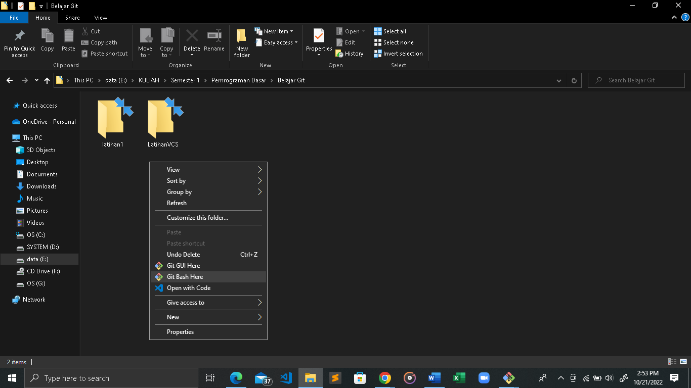

- Lalu ketik git clone [URL yang tadi dicopy di web Git]
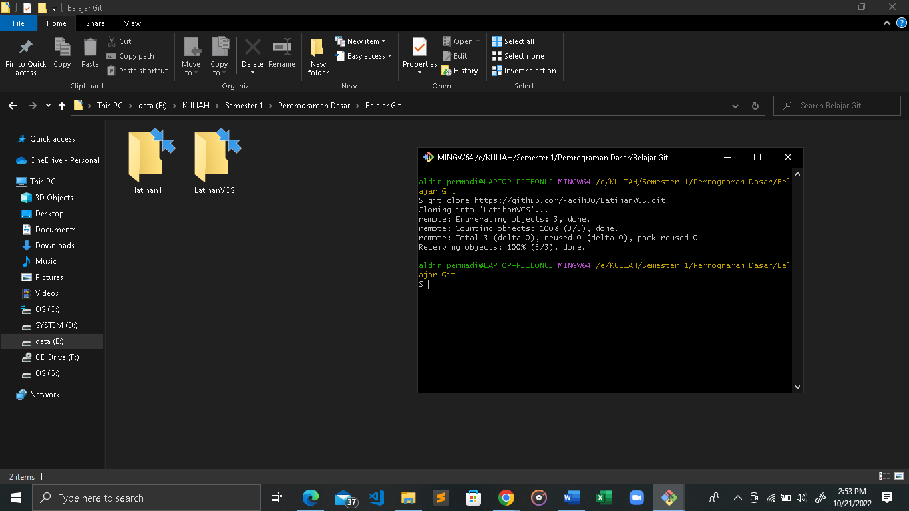

- Lalu akan muncul folder repository yang kita buat tadi di web Git beserta file README
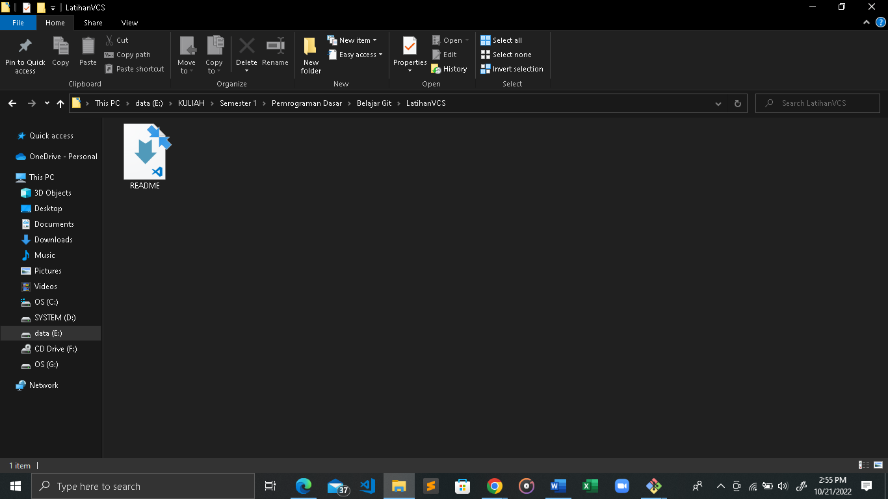

- Klik Git bash here untuk memunculkan perintah
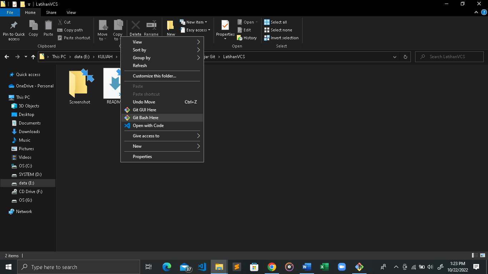

- Ketik perintah git status untuk melihat isi repository folder screenshot sudah masuk atau belum
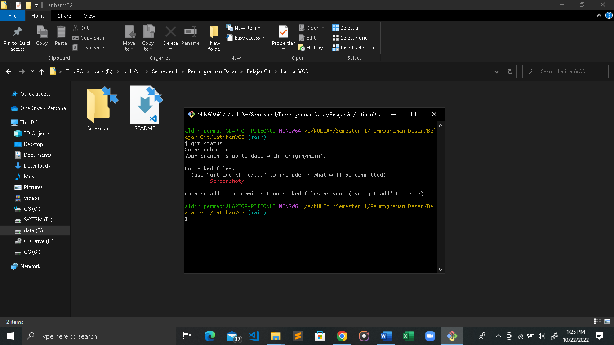

- Ketik perintah git add . untuk menambahkan foto yang ada di folder repository ke web Github
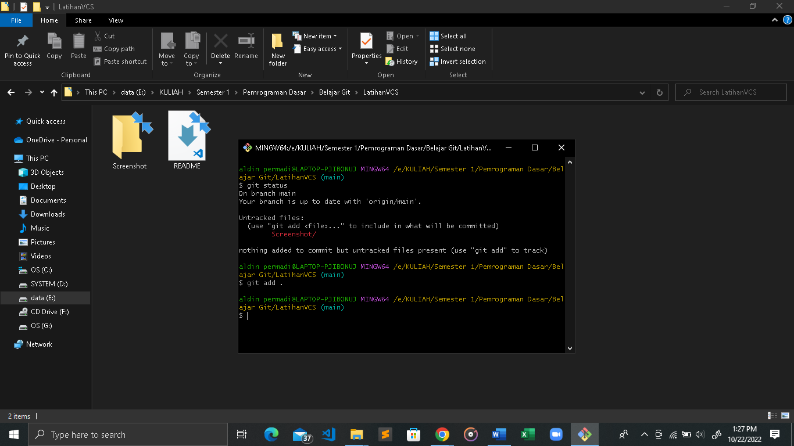

- Ketik perintah git commit -m untuk mengupload foto yang ada difolder ke web github
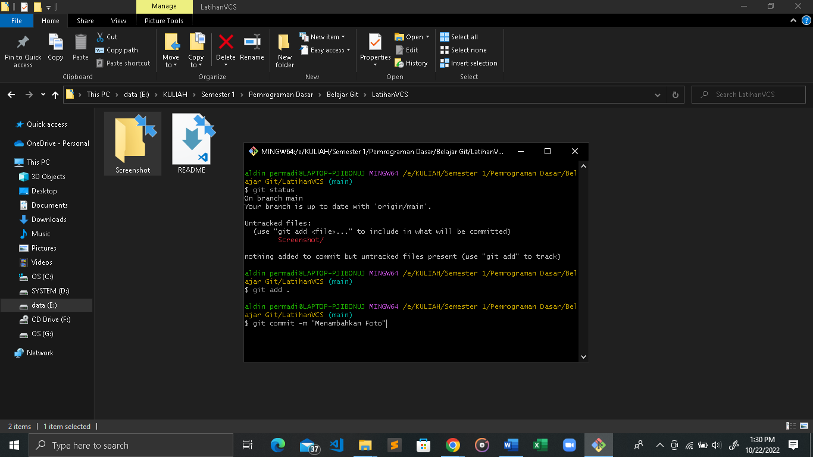

- Ketik perintah git push -u origin main untuk upload foto ke web github
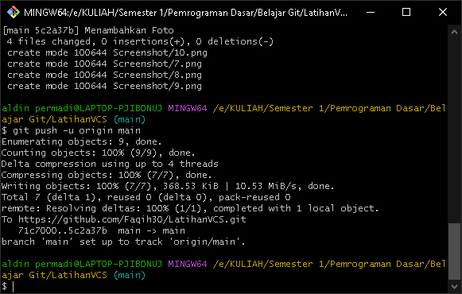

- Folder dan foto sudah terupload di web
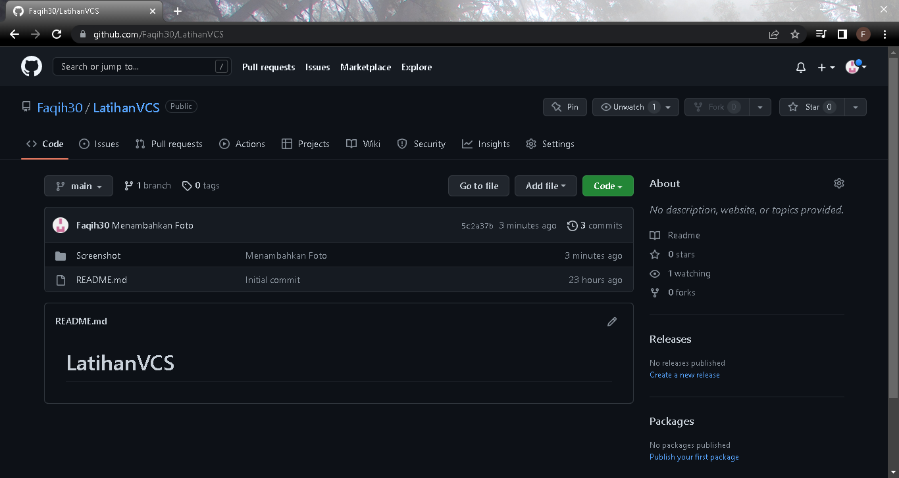

- Buka file README yang ada di folder Repository
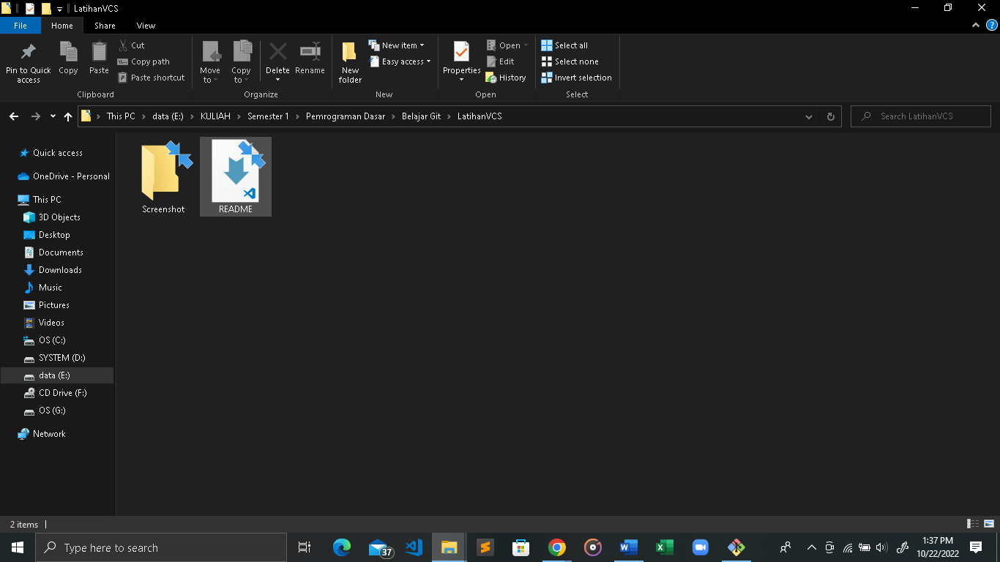

- Ketik kode sebagai berikut untuk mengupload gambar dan tulisan ke web Github
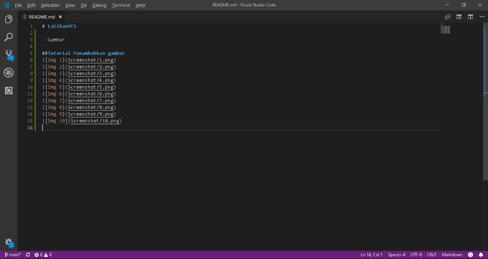

- Git add lalu git commit kembali
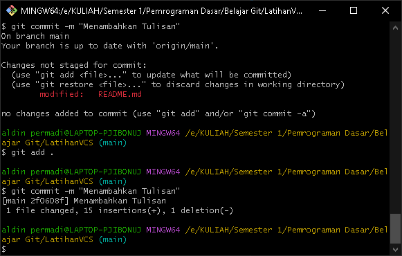

- Git push untuk upload file README
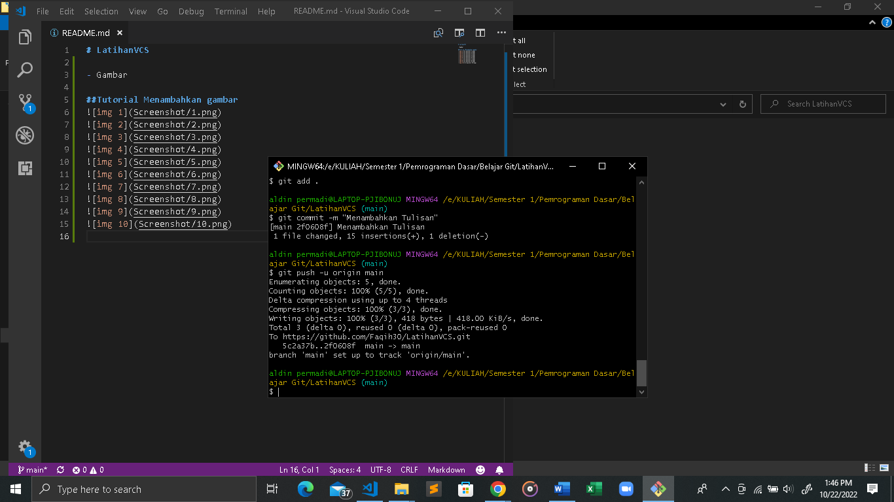

- File sudah terupload di web
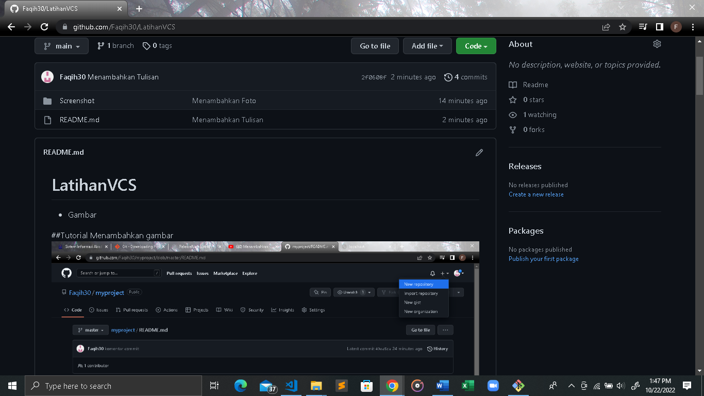